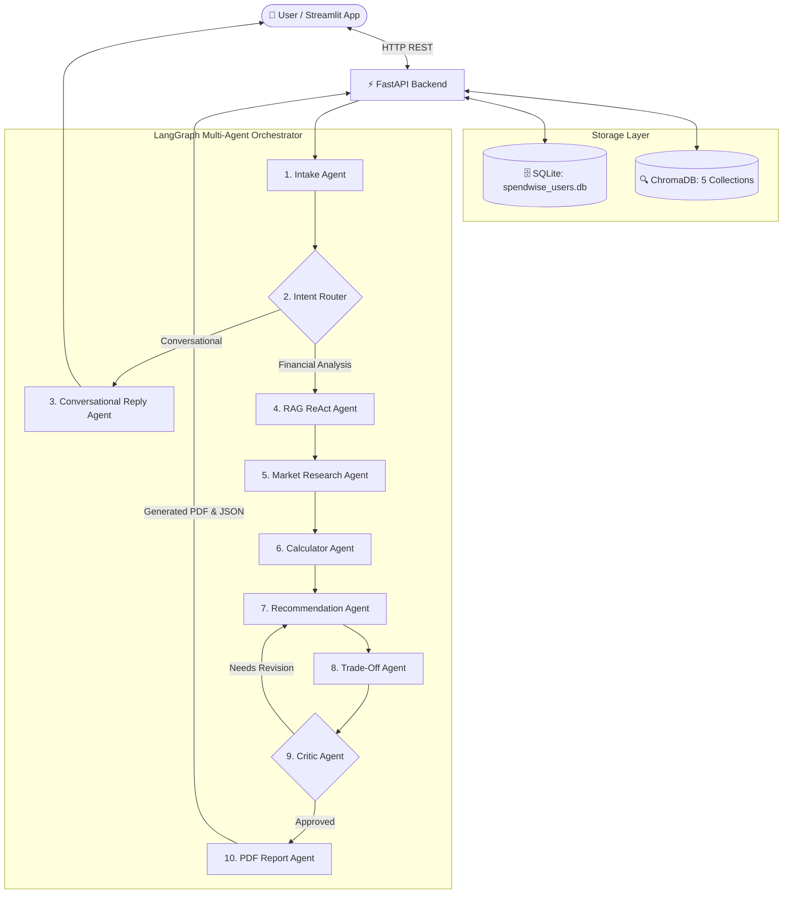

# 💰 SpendWise-AI: Intelligent Personal Financial Advisor

<p align="center">
  
  
  
  
  
  
</p>

---

## 📌 Table of Contents
- [Overview & Description](#-overview--description)
- [The Problem & The Need](#-the-problem--the-need)
- [Key Features](#-key-features)
- [System Architecture & Multi-Agent Workflow](#-system-architecture--multi-agent-workflow)
- [Data Storage & Vector Collections](#-data-storage--vector-collections)
- [Repository Structure](#-repository-structure)
- [Steps to Run Locally](#-steps-to-run-locally)
- [Testing & Quality Assurance](#-testing--quality-assurance)
- [Contributing](#-contributing)
- [License & Acknowledgments](#-license--acknowledgments)

---

## 📖 Overview & Description

**SpendWise-AI** is an end-to-end, multi-agent AI financial advisory ecosystem designed to deliver hyper-personalized, mathematically grounded, and market-aware personal finance planning.

Unlike traditional financial management tools that offer static budgeting charts or generic LLM chatbots prone to hallucination, **SpendWise-AI** combines:
1. **Deterministic Financial Calculation Engines** (Surplus, Savings Rate, Debt-to-Income (DTI), SIP targets, Emergency Fund goals, Tax regime choices).
2. **Multi-Collection Retrieval-Augmented Generation (RAG)** via ChromaDB across financial knowledge, tax rules, and user expense history.
3. **Live Market Intelligence** via Tavily web search integration.
4. **LangGraph Multi-Agent Orchestration** equipped with reflection and critic feedback loops.
5. **Automated PDF Report Generation** with integrated visual charts for offline review.

---

## 💡 The Problem & The Need

### The Challenge
Personal financial management in modern India is increasingly complex:
- **Information Overload & Misinformation:** Users are overwhelmed by generic advice on social media that doesn't fit their income, age, or risk persona.
- **Generic Chatbot Hallucinations:** Standard LLMs often struggle with exact mathematical calculations, hallucinate interest rates, or recommend budgets that exceed the user's actual disposable surplus.
- **Fragmented Tools:** Individuals are forced to use separate tools for tax estimation, budgeting spreadsheets, SIP return calculators, and investment research.

### The SpendWise-AI Solution
SpendWise-AI addresses these challenges through a **safety-first, hybrid architecture**:
- **Deterministic Math Guardrails:** All financial metrics (monthly surplus, DTI ratio, tax liability, savings rate) are calculated deterministically via code before LLM advice generation.
- **Persona-Aware RAG:** Custom retrieval algorithms match user personas (*Salaried, Student, Freelancer, Retiree*) with applicable tax slabs, investment vehicles, and debt repayment strategies.
- **Reflection & Self-Critique Loop:** A dedicated *Critic Agent* validates drafted recommendations against feasibility constraints (e.g., ensuring total recommended investments never exceed monthly surplus) before finalizing output.

---

## ✨ Key Features

- 👤 **Interactive User Onboarding & Persona Profiling:** Tailored experience matching individual risk tolerance, income, expenses, and debt obligations.
- 🤖 **LangGraph Multi-Agent Pipeline:**
  - **Intake Agent:** Normalizes and version-controls user profiles.
  - **Intent Router:** Differentiates between casual greetings, educational queries, and deep personal financial planning.
  - **RAG ReAct Agent:** Conducts persona-filtered vector searches across curated knowledge collections with category gap detection.
  - **Market Research Agent:** Performs targeted live web searches for current interest rates, inflation numbers, and RBI policy updates.
  - **Calculator Agent:** Executes deterministic financial formulas.
  - **Recommendation Engine:** Generates prioritized, quantitative action items.
  - **Trade-Off Agent:** Formulates alternative financial strategies with clear pros and cons.
  - **Critic Agent:** Self-corrects recommendations over multi-cycle reflection loops.
  - **Report Agent:** Renders professional PDF financial plans.
- 📊 **5-Collection ChromaDB Vector Store:** Micro-indexed vector storage for user profiles, expense history, financial knowledge base, market data, and past report summaries.
- 📄 **Automated ReportLab PDF Generation:** Creates downloadable, publication-grade financial health reports featuring income allocation pie charts and structured recommendation tables.
- 🛡️ **Secure Authentication:** SQLite database with SHA-256 password hashing.

---

## 🏗️ System Architecture & Multi-Agent Workflow



### Data & Execution Flow
1. **User Intake & Profile Management:** User inputs monthly income, essential/non-essential expenses, current savings, and EMI obligations via the Streamlit frontend. The profile is normalized and saved in SQLite and ChromaDB.
2. **Intent Routing:** User queries are classified into *conversational* (e.g., *"What is an SIP?"*) or *financial_analysis* (e.g., *"Analyze my monthly budget"*).
3. **Retrieval & Market Research:** The RAG ReAct agent fetches relevant tax/investment rules while the Market Research agent retrieves real-time market conditions.
4. **Deterministic Calculation:** Financial metrics (Surplus, Savings Rate, DTI Ratio, Emergency Fund target) are calculated by python modules.
5. **Reflection Loop & Critique:** Recommendations are drafted, checked against trade-offs, and reviewed by the Critic Agent.
6. **Report Generation & Storage:** A PDF report is compiled with Matplotlib charts, persisted to disk, and summary metadata is stored in ChromaDB for future multi-turn context.

---

## 🗄️ Data Storage & Vector Collections

SpendWise-AI utilizes ChromaDB with `sentence-transformers/all-MiniLM-L6-v2` embeddings across 5 specialized collections:

| Collection Name | Purpose & Contents |
|---|---|
| `user_profiles` | User financial state, income/expense breakdown, persona, and versioned metadata |
| `expense_history` | Historical transaction logs and category spending patterns |
| `financial_knowledge` | Curated tax rules (Old vs. New regime), SIP guidelines, debt strategies, and emergency fund rules |
| `market_data` | Live market snippets, RBI interest rates, and inflation benchmarks fetched via Tavily |
| `past_reports` | Summaries and metadata of previously generated PDF financial reports |

---

## 📂 Repository Structure

```
SpendWise-AI/
├── agents/
│   ├── graph.py                # LangGraph state machine & multi-agent pipeline definition
│   └── tools.py                # Financial calculation, Tavily search, and PDF generation tools
├── db/
│   └── vector_store.py         # ChromaDB 5-collection setup, embedding, and vector query helpers
├── finance_knowledge_base/     # Raw financial knowledge base (.txt, .docx, .pdf)
├── reports/                    # Generated PDF reports directory
├── test/                       # Unit & integration test scripts
│   ├── test_end_to_end.py
│   └── test.py
├── backend_app.py              # FastAPI REST API endpoints (/signup, /login, /save-profile, /chat)
├── config.py                   # Centralized environment & directory configuration
├── database.py                 # SQLite database setup & authentication functions
├── frontend_app.py             # Complete Streamlit Web Application frontend
├── knowledge_ingestion.py      # Section-aware knowledge document parser & ingestion pipeline
├── run_comprehensive_tests.py  # Comprehensive end-to-end automated test runner
├── requirements.txt            # Python dependencies
├── test.md                     # Comprehensive End-to-End Test Execution Report
└── README.md                   # Project documentation
```

---

## 🚀 Steps to Run Locally

### Prerequisites
- **Python 3.10+** installed
- **Git** installed
- Google Gemini API Key (`GEMINI_API_KEY`)
- Tavily API Key (`TAVILY_API_KEY`, optional for web search)

### 1. Clone the Repository
```bash
git clone https://github.com/singh-vidyush/SpendWise-AI.git
cd SpendWise-AI
```

### 2. Set Up Virtual Environment
```bash
python3 -m venv .venv
source .venv/bin/activate    # On Windows: .venv\Scripts\activate
```

### 3. Install Dependencies
```bash
pip install --upgrade pip
pip install -r requirements.txt
```

### 4. Configure Environment Variables
Create a `.env` file in the root directory:
```env
GEMINI_API_KEY=your_gemini_api_key_here
TAVILY_API_KEY=your_tavily_api_key_here
```

### 5. Ingest Knowledge Base into ChromaDB
Populate the vector store with domain financial knowledge:
```bash
python3 knowledge_ingestion.py
```

### 6. Launch Backend API Server
Start the FastAPI backend server:
```bash
uvicorn backend_app:app --reload --port 8000
```
*The API interactive documentation will be available at `http://localhost:8000/docs`.*

### 7. Launch Frontend Streamlit Application
In a separate terminal window (with virtual environment activated):
```bash
streamlit run frontend_app.py
```
*The web interface will open automatically in your default browser at `http://localhost:8501`.*

---

## 🧪 Testing & Quality Assurance

SpendWise-AI includes a comprehensive end-to-end testing framework covering database operations, vector store queries, knowledge ingestion, financial calculation edge cases, PDF generation, LangGraph agent routing, and FastAPI endpoints.

Run the test suite using:
```bash
python3 run_comprehensive_tests.py
```

Review the full test results, pass rates, and failure analysis in [test.md](test.md).

---

## 🤝 Contributing

Contributions are welcome! Whether you are interested in expanding the multi-agent graph, adding new financial calculation tools, improving the frontend UI, or extending the knowledge base, follow these steps:

1. **Fork the Repository**
2. **Create a Feature Branch**
   ```bash
   git checkout -b feature/AmazingFeature
   ```
3. **Commit your Changes**
   ```bash
   git commit -m "Add AmazingFeature"
   ```
4. **Push to the Branch**
   ```bash
   git push origin feature/AmazingFeature
   ```
5. **Open a Pull Request**

### Contribution Guidelines
- Maintain documentation integrity and type hints across Python files.
- Ensure all new agent tools include unit tests.
- Run `python3 run_comprehensive_tests.py` before submitting PRs to verify clean execution.

---

## 📜 License & Acknowledgments

Distributed under the MIT License. See `LICENSE` for more information.

**Built with:**
- [LangChain](https://github.com/langchain-ai/langchain) & [LangGraph](https://github.com/langchain-ai/langgraph)
- [FastAPI](https://fastapi.tiangolo.com/)
- [Streamlit](https://streamlit.io/)
- [ChromaDB](https://www.trychroma.com/)
- [ReportLab](https://www.reportlab.com/)
